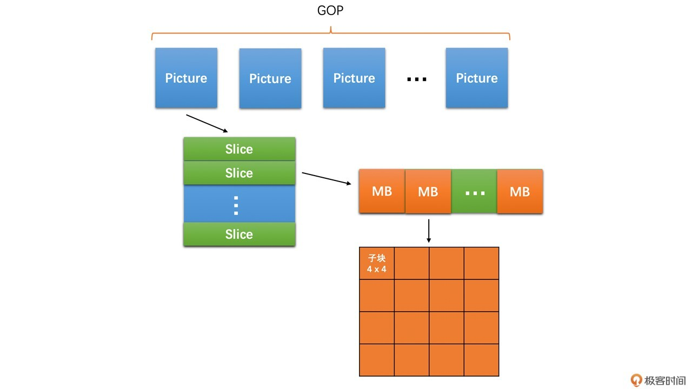
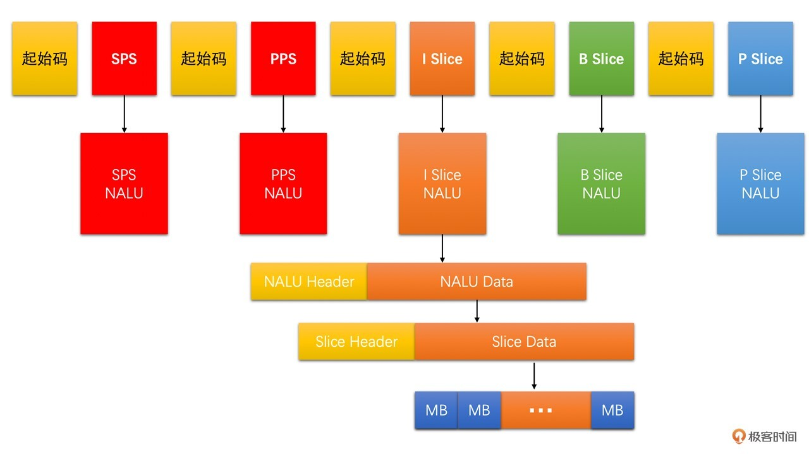
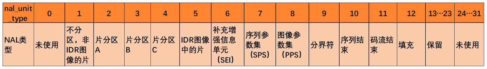
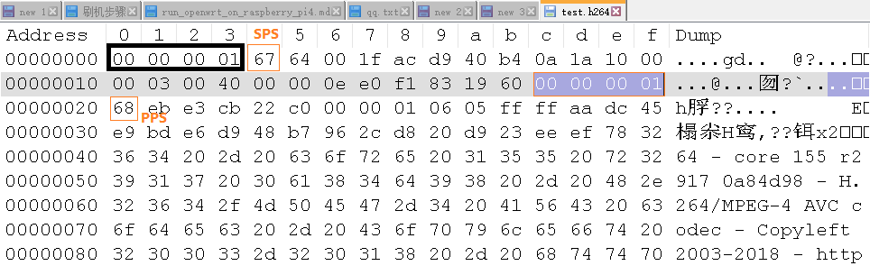
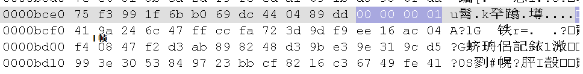

## 帧类型
I: 帧内编码，独立完成编解码，压缩率小
P：前向编码，参考前面的I帧和P帧，压缩率高
B：双向编码，参考前面和后面的I,P帧，压缩率最高，延时大

I -> P1 -> I -> P2
P2可依赖P1

IDR帧（立即刷新帧），一种特殊的I帧，为了避免I帧错误导致错误传递，IDR之后的帧不能再参考IDR帧之前的帧

I -> P1 -> IDR -> P2；P2不能参考IDR之前的帧

大多数情况下，不使用普通I帧，都是使用IDR帧

## GOP

一个IDR帧开始 到 下一个IDR帧的前一帧 为止，这里面包含的 IDR帧、普通I帧、P、 B帧，成为一个GOP（图像组）

GOP大小（两个IDR帧间隔成为 关键帧间隔），越大压缩率越高，出错需要更久才能恢复（下一个关键帧），点播场景下seek操作不方便。

## slice

H264编码的基本单元是 宏块(MB) ，大小为16×16， 一个slice包含整数个宏块

## H264 码流结构

1. Annexb 格式
  也叫MPEG-2 transport stream format格式（ts格式）, ElementaryStream格式
  使用起始码表示一个编码数据的开始，起始码用作分隔。
  起始码有两种, 4字节 00 00 00 01
               3字节 00 00 01
  数据转义（避免与起始码重复）：
  00 00 00 -> 00 00 03 00
  00 00 01 -> 00 00 03 01
  00 00 02 -> 00 00 03 02
  00 00 03 -> 00 00 03 03

  Annexb 最终格式：
  00 00 00 01  转义后的编码数据 00 00 00 01 转义后的编码数据

2. AVCC 格式
  也叫AVC1格式，MPEG-4格式，字节对齐，因此也叫Byte-Stream Format。
  用于mp4/flv/mkv

    没有起始码，在编码数据的开始使用4个字节作为长度标识，用来表示编码数据的长度。

    **格式**：
    长度标识 编码数据 长度标识 编码数据

以下以Annexb为例

### NALU
SPS: 序列参数集
    包含图像的宽、高、YUV格式、位深等

PPS：图像参数集
    熵编码类型、基础QP、最大参考帧数量等

H264码流
起始码 SPS 起始码 PPS 起始码 Islice 起始码 Bslice 起始码 Pslice ...

如何在码流中区分这几种数据呢？所有的数据都是用NALU（网络抽象层单元）结构。

NALU header为1个字节

bit:
0  : F forbiden_zero_bit, H264设置为0
1~2: NRI： nal_ref_idc 表示当前NALU的重要性，参考帧、SPS PPS对应的值大于0
3~7: Type nal_unit_type 取值如下

因此 header字段
SPS : 0x67 0x27 0x47    0x07不合法
PPS : 0x68
IDR : 0x65
普通I：0x61 0xx1

 ffmpeg -i test.mp4 -an -vcodec libx264 -crf 23 test.h264

文件示例:

I 帧：

